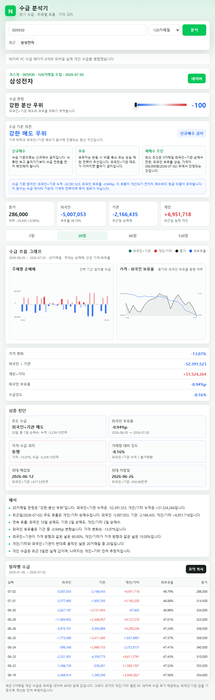

# Redefine Browser 02: 네이버 증권 수급 분석기

브라우저 재발견 시리즈 두 번째 프로젝트입니다.

네이버 증권 데이터를 기반으로 외국인, 기관, 개인/기타 수급을 장기 분석하고, 그래프와 수급 기준 매수·매도 전략을 보여주는 Chrome 확장프로그램입니다.



## 핵심 기능

- 종목명 또는 종목코드 검색
- 20/60/120거래일 장기 수급 수집
- 외국인+기관 누적 순매수/순매도 분석
- 개인/기타 잔여 수급 추정
- 외국인 보유율 변화 추적
- 가격과 수급의 괴리 분석
- 수급 막대 그래프
- 가격·외국인 보유율 라인 그래프
- 수급 기준 매수·매도 전략
- 일자별 장기 수급표
- 분석 요약 클립보드 복사

## 왜 만들었나

네이버 증권은 좋은 데이터를 제공하지만, 실제 투자 판단 과정에서 필요한 질문은 단순하지 않습니다.

- 외국인과 기관이 누적으로 사고 있는가?
- 가격은 빠지는데 수급은 들어오는가?
- 가격은 오르는데 주체 수급은 이탈하는가?
- 외국인 보유율은 추세적으로 올라가는가, 내려가는가?
- 지금은 매수 우위인가, 관망인가, 비중축소인가?

이 확장프로그램은 이런 질문을 브라우저 팝업 안에서 바로 확인하기 위해 만들었습니다.

## 데이터 출처

- 종목 검색: `https://ac.stock.naver.com/ac`
- 최근 실제 개인 수급: `https://m.stock.naver.com/api/stock/{종목코드}/integration`
- 장기 외국인/기관 수급: `https://finance.naver.com/item/frgn.naver?code={종목코드}&page={페이지}`

네이버 모바일 API는 현재 최근 5거래일의 실제 개인 수급만 제공합니다.  
5거래일을 초과한 과거 구간의 `개인/기타`는 PC 네이버 수급 표의 외국인·기관 값을 기준으로 계산한 잔여 추정치입니다.

## 설치

1. Chrome 주소창에서 `chrome://extensions`를 엽니다.
2. 오른쪽 위 `개발자 모드`를 켭니다.
3. `압축해제된 확장 프로그램을 로드`를 누릅니다.
4. 이 저장소의 `extension` 폴더를 선택합니다.

업로드용 ZIP이 필요하면 루트의 `naver-supply-extension.zip`을 사용할 수 있습니다.

## 사용법

1. 확장프로그램 아이콘을 클릭합니다.
2. `삼성전자`, `NAVER`, `005930`처럼 종목명 또는 종목코드를 입력합니다.
3. 수집 기간을 `20거래일`, `60거래일`, `120거래일` 중 선택합니다.
4. 분석 버튼을 누릅니다.
5. 수급 판정, 매수·매도 전략, 그래프, 진단 카드, 일자별 표를 확인합니다.

## 수급 전략 분류

확장프로그램은 수급 점수와 흐름을 바탕으로 다음과 같이 기계적으로 분류합니다.

- 매수 우위
- 조건부 매수
- 관망
- 매도 우위
- 강한 매도 우위

각 상태마다 실행 전략도 같이 표시합니다.

- 분할매수
- 소액 분할
- 대기
- 비중축소
- 신규매수 금지

## 프로젝트 구조

```text
extension/
  manifest.json
  popup.html
  popup.css
  popup.js
  icons/
docs/
  images/
    dashboard.png
naver-supply-extension.zip
README.md
```

## 제작 노트

처음 버전은 모바일 네이버 API의 최근 5거래일 수급만 사용했습니다.  
하지만 5일치 데이터로는 장기 수급의 방향성과 누적 매집/분산을 읽기 어려웠습니다.

그래서 PC 네이버 수급 페이지를 여러 페이지 순회해 20/60/120거래일 데이터를 가져오고, 최근 5거래일 실제 개인 수급과 병합했습니다.

자세한 제작 과정은 [docs/build-notes.md](docs/build-notes.md)에 정리했습니다.

## 주의

이 도구는 투자 참고용 데이터 분석 도구입니다.  
매수·매도 전략은 수급 데이터 기반의 기계적 분류이며, 투자 권유나 수익 보장을 의미하지 않습니다.

